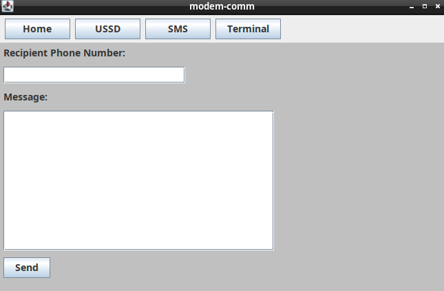
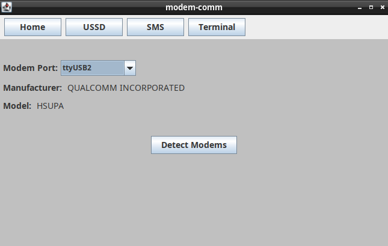

# modem-comm
**Warning**: This software is still in a very early stage of development.  

modem-comm is a program for communicating with serial modems that was developed to be able to run under many different operating systems. It includes both a graphical user interface
as well as a command-line interface meaning that it can be used both in a graphical and a text-based setting. Additionally it can be easily integrated with scripts. modem-com was tested under Linux and Windows.  

Some currently supported features include sending SMS messages, sending USSD codes, scanning serial ports to detect modems, and launching terminals for communicating with arbitrary serial ports.

## Building

The build-process is managed using Apache Maven. To build it on your system,

1. Install Java and Apache Maven
2. Download `pom.xml` and the `src/` directory from this repository
3. `cd` into the directory containing `pom.xml` and `src/`
4. run `mvn clean package`

The resulting `.jar` file can be found in the `target/` directory as `modem-comm-VERSION.jar` and can be run using `java -jar modem-comm-VERSION.jar`

## User Interface Screenshots

SMS messaging user interface:  

Home screen user interface:  

